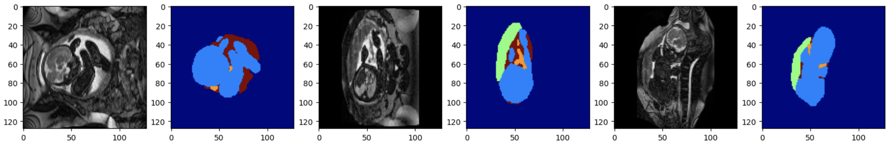

# fetal-segmentation

# Project Summary

This repository showcases a complete deep learning pipeline for **multi-label segmentation** of fetal anatomical structures (fetus, placenta, umbilical cord, and amniotic fluid) in **bSSFP MRI scans**.  
The project is designed for research and educational use, aiming to support clinical translation of automated fetal MRI analysis through **open-source, benchmarked models**.

---

## Objective

This project implements and compares two deep learning pipelines for automated segmentation of fetal and uterine structures in volumetric MRI:

- **MONAI-based models** (2D and 3D U-Net)
- **nnU-Net-based models** (2D and 3D full-resolution)

The goal is to evaluate and compare the performance of these two popular medical imaging frameworks on multi-label segmentation tasks involving:
- Fetal body  
- Placenta  
- Umbilical cord  
- Amniotic fluid

Performance is evaluated using:
- **Dice score**
- **Volume overlap**
- **Precision & recall**
- **Qualitative visualization**

---

## Code Overview

| File | Description |
|------|-------------|
| `2d-preprocessing-training.py` | Trains and evaluates a **2D MONAI U-Net** using slice-wise fetal MRI data. Includes preprocessing, augmentation, training, and visualization. |
| `3d-preprocessing-training.py` | Trains and evaluates a **3D MONAI U-Net** on full volumetric MRI using sliding window inference and Dice + CE loss. |
| `2d-testing.py` | Inference and visualization script for the **2D MONAI model**. Overlays predicted segmentations on grayscale MRI slices. |
| `3d-testing.py` | Inference and visualization script for the **3D MONAI model**, showing segmentation overlays in 3D anatomical views. |
| `2d-3d-nnunet.py` | Configures and trains **2D and 3D nnU-Net** models using the framework’s auto-configuration and training pipeline. |

---

## Example Outputs

### MONAI 2D U-Net

- **Beginning of training**  
  

- **End of training**  
  

- **Overlayed prediction**  
  

- **Training and validation loss**  
  

---

### MONAI 3D U-Net

- **Beginning of training**  
  

- **End of training**  
  

- **Overlayed prediction**  
  

- **Training and validation loss**  
  

---

### MONAI Validation Dice Trend

---

### nnU-Net Training

- **2D (Fold 4)**
  

- **3D Full-Resolution (Fold 4)**
  

- **3D Low-Resolution (Fold 4)**
  

---

## References

### MONAI
- MONAI: Medical Open Network for AI  
  Website: [https://monai.io](https://monai.io)  
  GitHub: [https://github.com/Project-MONAI/MONAI](https://github.com/Project-MONAI/MONAI)  
  Citation:
@article{cardoso2022monai,
title={MONAI: An open-source framework for deep learning in healthcare},
author={Cardoso, M. Jorge and Li, Wenqi and Brown, Tom and others},
journal={arXiv preprint arXiv:2211.02701},
year={2022}
}

### nnU-Net
- nnU-Net: The self-configuring framework for medical image segmentation  
Website: [https://www.nnunet.org](https://www.nnunet.org)  
GitHub: [https://github.com/MIC-DKFZ/nnUNet](https://github.com/MIC-DKFZ/nnUNet)  
Citation:
@article{isensee2021nnu,
title={nnU-Net: a self-configuring method for deep learning-based biomedical image segmentation},
author={Isensee, Fabian and Jaeger, Paul Ferdinand and Kohl, Simon Andreas August and Petersen, Jens and Maier-Hein, Klaus H},
journal={Nature Methods},
volume={18},
number={2},
pages={203--211},
year={2021},
publisher={Nature Publishing Group}
}

